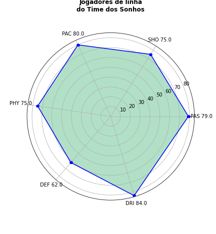
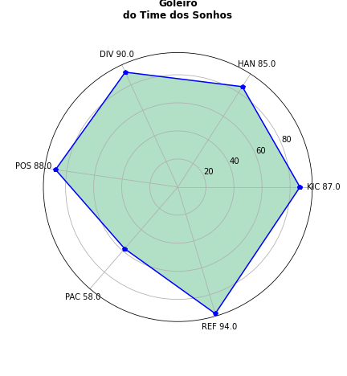

# LP-A2-FINAL 

*Trabalho final da disciplina Linguagens de Programação 2020.2*

O objetivo do trabalho é fornecer uma base real, complexa e suja para que o grupo, após
entender os dados, formule questões de negócio interessantes e as responda em um relatório -
fornecendo todos os artefatos utilizados na análise para avaliação.

## Alunos

> ↳ [Erick Brito](https://github.com/Erickslb)  
> ↳ [Germano Andrade](https://github.com/GermanoAndrade)  
> ↳ [João Alcindo Ribeiro](https://github.com/joao-alcindo)  
> ↳ [Patrick Saul Amaral](https://github.com/Patrick20022)  
> ↳ [Sávio Vinícius Amaral](https://github.com/savio160502)  

## Conexão e Escolha das Bases

Através da biblioteca [`pyodbc`](https://pypi.org/project/pyodbc/) do python foi feita a conexão com a base de dados fornecida e extraídos os conjunto de 
dados escolhidos e posteriormente exportados para csv, que podem ser encontrados na pasta [dataframes](./dataframes).

## Perguntas de Negócio

Uma vez escolhidas as bases, as seguintes perguntas foram elaboradas para serem respondidas com modelos implementados no python.

- Base do FIFA 19
	1. Dado um empresário com qualquer orçamento, qual o melhor elenco
		que ele pode ter, visando ganhar vários campeonatos? E qual seria o
		custo para ter esse elenco?
	2. Dado um time com qualquer orçamento, qual o melhor elenco que ele
		pode ter visando ter o melhor retorno com as vendas dos jogadores no
		longo prazo? E qual seria o custo para ter esse elenco?

	3. Dado o conjunto dos 50 melhores jogadores avaliados, qual a porcentagem deles que preferem chutar com o pé esquerdo?

	
- Base do Real State Values  
	1. Se uma pessoa prioriza acima de tudo a segurança, qual seria a distância
		ponderada para os cinco centros de empregos de Boston?
	2. Se uma pessoa acredita que uma taxa de aluno-professor não possa
		ser maior que 15 alunos por professor, qual seria o menor índice de
		criminalidade que ele conseguiria?
	3. Se uma pessoa quer que sua área seja limitada por um rio, qual seria a
		maior e a menor quantidade média das casas ocupadas?
		
## Diagrama das soluções

Para responder a essas perguntas, o seguinte diagrama foi elaborado.

	

## Modelos Estatísticos

### ➔ FIFA 19

Para a contrução do modelo, percebemos que havia uma relação entre o valor de contrato de um jogador
e o valor da quebra de contrato, obtendo assim um R² de `0.961`

	

Por fim, dividimos o conjunto de dados em treino e teste para fazer uma previsão dos valores dos jogadores 
com os valores estimados, como mostra as figuras abaixo.

	
  &nbsp;&nbsp;&nbsp;&nbsp;&nbsp;&nbsp;&nbsp;&nbsp;&nbsp;&nbsp;&nbsp;&nbsp;&nbsp;&nbsp;&nbsp;&nbsp;&nbsp;&nbsp;&nbsp;&nbsp;&nbsp;&nbsp;
  &nbsp;&nbsp;&nbsp;&nbsp;&nbsp;&nbsp;&nbsp;&nbsp;&nbsp;&nbsp;&nbsp;&nbsp;&nbsp;&nbsp;&nbsp;&nbsp;&nbsp;&nbsp;&nbsp;&nbsp;&nbsp;&nbsp;
	

### ➔ Real State Values 

Começamos fazendo uma análise descritiva e exploratória dos dados, e assim
começamos a pensar que o índice de indústrias não varejistas(INDUS) tinha uma
correspondencia com o índice da concetração do nitrato de oxigênio(NOX ).

	

Por fim dividimos o conjunto de dados em treinos e testes para fazermos uma
análise das taxas e as taxas prevista e encontramos um R2 de 0, 886 como mostra
a figura abaixo.

	
  &nbsp;&nbsp;&nbsp;&nbsp;&nbsp;&nbsp;&nbsp;&nbsp;&nbsp;&nbsp;&nbsp;&nbsp;&nbsp;&nbsp;&nbsp;&nbsp;&nbsp;&nbsp;&nbsp;&nbsp;&nbsp;&nbsp;
  &nbsp;&nbsp;&nbsp;&nbsp;&nbsp;&nbsp;&nbsp;&nbsp;&nbsp;&nbsp;&nbsp;&nbsp;&nbsp;&nbsp;&nbsp;&nbsp;&nbsp;&nbsp;&nbsp;&nbsp;&nbsp;&nbsp;
	

## Visualizações

### ➔ FIFA 19

A partir das muitas colunas do dataframe, visando a diminuir a quantidade de
dados para entender melhor os jogadores/times, criamos colunas com os atributos
técnicos dos jogadores de linha e golerio, conforme as tabelas a seguir.  

Os seis principais atributos técnicos dos jogadores de linha.

  

Sigla|Significado|Tradução
:-:|:-:|:-:
PAS| Passing	| Passe
CHO| Shooting	| Remate
PAC| Pace		| Velocidade/Ritmo	
PHY| Physical	| Físico/Resistência
DEF| Defense	| Defesa
DRI| Dribbling	| Drible/Finta

Os seis principais atributos técnicos dos guarda-redes / goleiros.

  

Sigla|Significado|Tradução
:-:|:-:|:-:
KIC| Kicking	| Pontapé/Chutão
HAN| Handlin	| Manuseio
DIV| Diving		| Mergulho
POS| Position	| Posicionamento
SPD| Speed		| Velocidade
REF| Reflexes	| Reflexos

Feito isso, de acordo com a solução encontrada para as perguntas da base do
FIFA, para um time baseado no *Overall* atual dos jogadores, tivemos o seguinte

	
  &nbsp;&nbsp;&nbsp;&nbsp;&nbsp;&nbsp;&nbsp;&nbsp;&nbsp;&nbsp;&nbsp;&nbsp;&nbsp;&nbsp;&nbsp;&nbsp;&nbsp;&nbsp;&nbsp;&nbsp;&nbsp;&nbsp;
  &nbsp;&nbsp;&nbsp;&nbsp;&nbsp;&nbsp;&nbsp;&nbsp;&nbsp;&nbsp;&nbsp;&nbsp;&nbsp;&nbsp;&nbsp;&nbsp;&nbsp;&nbsp;&nbsp;&nbsp;&nbsp;&nbsp;
	
	

  

Já pensando em longo prazo, o time baseado no Potential dos jogadores, teríamos as seguintes pontuações dos Skills:

	
  &nbsp;&nbsp;&nbsp;&nbsp;&nbsp;&nbsp;&nbsp;&nbsp;&nbsp;&nbsp;&nbsp;&nbsp;&nbsp;&nbsp;&nbsp;&nbsp;&nbsp;&nbsp;&nbsp;&nbsp;&nbsp;&nbsp;
  &nbsp;&nbsp;&nbsp;&nbsp;&nbsp;&nbsp;&nbsp;&nbsp;&nbsp;&nbsp;&nbsp;&nbsp;&nbsp;&nbsp;&nbsp;&nbsp;&nbsp;&nbsp;&nbsp;&nbsp;&nbsp;&nbsp;
	

  

Um ponto interessante a destacar é a diferença de idade entre esses times. Isso,
porque é normal que o time visando no longo prazo seja composto em sua maioria
por jogadores mais jovens, e isso é o que podemos ver no seguinte gráfico:

	

  

Outra análise interessante entre os dois times é no quesito de preço (valor total
que o time custa).

	

  

Agora, em relação ao **Pé Dominante** dos jogadores (conforme a 3ª pergunta
sobre essa base), podemos ver a diferença em percentual entre *Canhotos* e *Destros*,
dado o conjunto dos 50 jogadores com maior *Overall*.

	

  

### ➔ Real State Values 

Para o conjunto de dados do Real State Values, uma relação interessante
foi entre a Distância entre os grandes centros de empregos de Boston e a Taxa de
Crimes.

	

  

Podemos observar que ao passo que a distância diminui, as taxas de crimes são
maiores.
